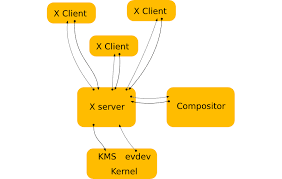
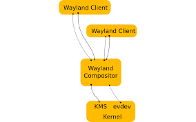

# Display server protocols 
## X11
+ By design, X11 is **network-transparent**.
+ This allows the possibility of running the client and the server either on the same machine or different ones.
+ A client and a server can also communicate over the internet through an encrypted network session.

  

## Wayland
+ Wayland is **a communication protocol that specifies the communication between a display server and its clients, as well as a C library implementation of that protocol.**
+ A display server using the wayland protocol is called a wayland compositor, because it additionally performs the task of a compositing window manager.




# xrandr - (manage displays)
Primitive command line interface to RandR extension

Xrandr is used to set the size, orientation and/or reflection of the outputs for a screen. It can also set the screen size.

+ Use the **xrandr** command to list the available displays and their current status. The output will show the name of your connected displays. The display name willl be like **VGA-1**, **HDMI-1** or **DP-1**.
```bash
$ xrandr
```

+ Use the **xrandr --output** command to set up the extended display. Replace **HDMI-1** with the actual name of your display.
```bash
$ xrandr --output HDMI-1 --mode 1920x1080 --pos 0x0 --rotate normal --output <primary-display> --mode 1920x1080 --pos 1920x0 --rotate normal
```

   - --output HDMI-1 : Specifies the output display
   - --mode 1920x1080 : Specifies the resolution of the display.
   - --pos 0x0 : Specifies the position of the display. Adjust the values according to your desired layout.
   - --rotate normal : Specifies the rotation of the display. Use **normal, left, right or inverted** as needed.
   - --output < primary-display > : Specifies the primary display
   - --mode 1920x1080 : Specifies the resolution of the primary display.
   - --pos 1920x0 : Specifies the position of the primary display. Adjust the values based on you desired layout.

+ Set the desired resolution for the second display using the '--mode' option.
```bash
$ xrandr --output HDMI-1 --mode 1920x1080 --right-of <primary-display>
```

   - --output HDMI-1 : Specifies the output display
   - --mode 1920x1080 : Specifies the resolution of the display

+ Specify the resolution for both display.
```bash
$ xrandr --output <primary-display> --mode <primary-resolution> --output HDMI-1 --mode 1920x1080 --right-of <primary-display>
```

   - < primary-display > : Replace with the name of the primary display.
   - < primary-resolution > : Replace with the resolution of your primary display.

+ Duplicate the screen with a **--same-as** 
```bash
$ xrandr --output HDMI-1 --mode 1920x1080 --same-as <primary-display>
```

   - --output HDMI-1 : Specifies the output display
   - --mode 1920x1080 : Specifies the resolution of the display
   - --same-as < primary-display > : Specifies that the display should be duplicated to the primary display.

+ Specify the resolution for both display, using is **--same-as**
```bash
$ xrandr --output <primary-display> --mode <primary-resolution> --output HDMI-1 --mode 1920x1080 --same-as <primary-display>
```

+ Extend the screen with automatic resolution detection
```bash
$ xrandr --output HDMI-1 --auto --right-of <primary-display>
```

   - --auto : Tells xrandr to automatically detect and use the preferred/native resolution of the display.

+ Duplicate the screen with automatic resolution detection.
```bash
$ xrandr --output HDMI-1 --auto --same-as <primary-display>
```

