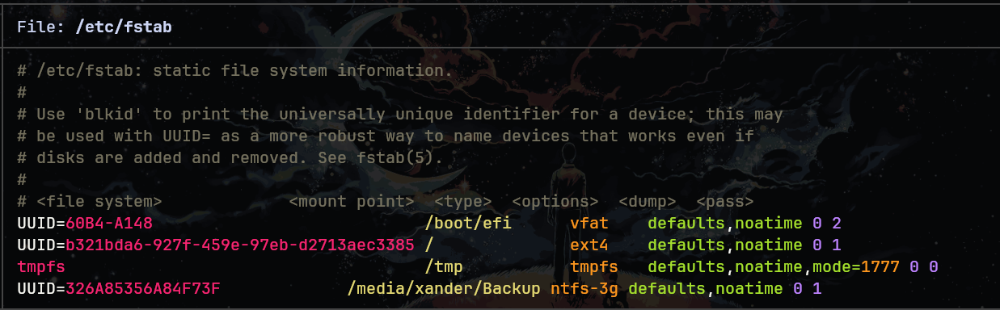

# LINUX FILE SYSTEM
Linux file system contains
- The root directory (/).
- A specific data storage format (EXT3, EXT4, BTRFS, XFS & so on).
- A partition or logical volume having a particular file system.

## Directory Structure
###  /
Root file system

### /boot
Include the static kernel and bootloader configuration and executable file needed to start a linux.

### /bin
Executable file

### /dev
Include the device file for all hardware devices connected to the system there aren't device drivers, instead they are files that indicate all devices on the system and provided access to there devices.

### /etc
Include the local system configuration file for the host system.

### /lib
Include shared library files that are needed to start the system.

### /home
Home directory storage is available for user file all users have subdirectory inside /home

### /mnt
Temporary mount point for basic file system.

### /media
Mounting external removable media devices like USB thumb drives that might be linked to the host.

### /opt
Vendor supplied application program that must be placed.

### /root
Its the home directry for a root user.

### /tmp
temporary directory used by the OS and several program for storing temprory file.

### /sbin
These are system binary file they are executable utilized for system administration.

### /usr
They are read only and shareable files, including executable libraries and binaries, man files and several documentation types.

### /var
Variable data files are saved contain MySQL, log file , etc..


## Linux File System features
+ Specifying paths
+ Partition, directories & drives.
+ Case sensitivity.
+ File extensions.
+ Hidden Files.

# TYPES OF LINUX FILE SYSTEM
## Ext, Ext2, Ext3 & Ext4 file system
+ Extended file system
+ The ext4 file system is **a scalable extension of the ext3 file system,** which was the default file system of Red Hat Enterprise Linux 5.
+ Ext4 was the default on Red Hat Enterprise Linux 6. One file can be up to 16 TiB. The filesystem can be far larger, up to 1 EiB.

## JFS file system
+ Journaled file system
+ stability is needed with few resources.
+ handy file system when CPU power is limited.
+ Legacy. Systems that used to default to JFS use XFS now.

## ReiserFS file system
+ Journaled filesystem from the early 2000s. It is removed from current kernels.
+ Do not use it for a new disk. If an old disk still has it, copy the data off and reformat.

## XFS file system
+ Journaled filesystem aimed at large files and parallel I/O. Default on RHEL and many enterprise installs.
+ Can grow a filesystem online. It cannot shrink.
+ Check and repair with the volume unmounted: `xfs_repair /dev/sdX1`.
+ Create with `mkfs.xfs`.

## Btrfs file system
+ Copy-on-write filesystem. Checksums data and metadata, so silent corruption is detectable.
+ Subvolumes, snapshots, and (on some setups) multiple devices in one filesystem.
+ Default on Fedora Workstation and openSUSE. On Arch install with `btrfs-progs`.
+ Snapshots are cheap because unchanged blocks are shared. A snapshot is not a backup until it is copied to another disk.

## swap
+ Disk space the kernel uses when RAM is under pressure, and for hibernation.
+ Can be a partition or a file. See active swap with `swapon --show` or `cat /proc/swaps`.
+ Turn on and off: `sudo swapon /swap/file` and `sudo swapoff /swap/file`.
+ A swap file on Btrfs needs special attributes. A swap partition avoids that.


# Directories this list skipped
### /proc
Virtual filesystem. Process and kernel state as files (`/proc/cpuinfo`, `/proc/<pid>`). Nothing here is stored on disk.

### /sys
Virtual filesystem for devices, drivers, and kernel tunables.

### /run
Runtime data since the last boot: PID files, sockets. Cleared on reboot. Replaces the old `/var/run`.

### /srv
Data served by this machine (web sites, FTP). Optional. Many systems leave it empty.

### /lost+found
Created by `fsck` on ext filesystems. Holds detached files recovered after corruption.

### /bin, /sbin, /lib after the usr merge
On current Arch, `/bin`, `/sbin`, and `/lib` are symlinks into `/usr`. New programs land in `/usr/bin`. Do not treat `/bin` and `/usr/bin` as two different trees.

# Mounting a disk
## See disks and filesystems
```bash
$ lsblk -f
$ findmnt
$ sudo blkid
```

`lsblk -f` shows the device, filesystem type, UUID, and current mount point.

## Mount and unmount by hand
```bash
$ sudo mkdir -p /mnt/data
$ sudo mount /dev/sdb1 /mnt/data
$ sudo umount /mnt/data
```

`umount` fails while a process still has a file open under that path. `findmnt /mnt/data` shows what is mounted there. `fuser -vm /mnt/data` shows who is using it.

## fstab fields
`/etc/fstab` is read at boot. One filesystem per line:

```text
UUID=<uuid>  /media/Backup  ext4  defaults,nofail  0  2
```

| Field | Meaning |
| ----- | ------- |
| 1 | Device. Prefer `UUID=` from `blkid`. Device names like `/dev/sdb1` can change. |
| 2 | Mount point. The directory must already exist. |
| 3 | Filesystem type (`ext4`, `xfs`, `btrfs`, `vfat`, `swap`). |
| 4 | Options. `defaults` is rw, suid, dev, exec, auto, nouser, async. Add `nofail` for a disk that may be unplugged, or a missing disk drops boot into an emergency shell. |
| 5 | Dump flag. `0` skips dump. Almost always `0`. |
| 6 | fsck order. `1` for root, `2` for other local filesystems, `0` to skip. |

After editing fstab, `sudo mount -a` mounts everything in the file. If that command errors, fix the line before rebooting. A line that fails during boot drops you to an emergency shell. Getting out of that shell is `linux/troubleshooting.md`. An encrypted disk is `linux/luks.md`.


# Auto Mount Drives in Linux on Boot
## Step1:
Make a directory with the name Backup in a /media directory.
```bash
$ sudo mkdir /media/Backup
```

## Step2: 
Then collect the information of disk which you want to mount.

+ To find the mounted path of the disk e.g. /dev/sdb1
```bash
$ sudo fdisk -l
```

+ To collect the UUID information of disk
```bash
$ sudo blkid
```

## Step3: 
Edit `/etc/fstab`. A bad line here breaks the next boot, so run `mount -a` before rebooting.
```bash
$ sudo vim /etc/fstab
```

+ Edit the file and add the information you collected in this file.

## Step4:
At the end the file should look like this.


## Step5:
Mount every filesystem listed in fstab, and fix the line if this command errors.
```bash
$ sudo mount -a
```

