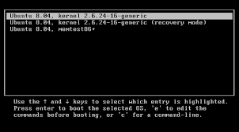
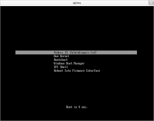
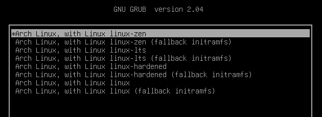

# Kernel 
+ Kernel is the main component of a linux operating system(OS) and is the core interface between a computer's hardware and it's process.
+ It communicates between the 2, managing resources as efficiently as possible.

## Types of Kernel
### Stable
+ Vanilla Linux kernel and modules, with a few patches applied.
+ The stable kernel is also the default kernel in most linux distributions, and it is supported by the community and the kernel developers.

[stable kernel website](https://www.kernel.org)

### Hardened
+ A security-focused Linux kernel applying a set of hardening patches to mitigate kernel and userspace exploits. It also enable more upstream kernel hardening features the linux.
+ The term kernel hardening refers to a strategy of using specific kernel configuration options to limit or prevent certain types of cyber attacks.

[hardened kernel github](https://github.com/anthraxx/linux-hardened)

### Longterm
+ Long-term support(LTS) linux kernel and modules.
+ Longterm(LTS) are usually several "longterm maintenance" kernel releases provided for the purpose of backporting bugfixes for older kernel trees.
+ Only important bugfixes are applied to such kernels and they don't usually see very frequent releases, especially for older trees.

[long term kernel website](https://www.kernel.org)

### Zen Kernel
+ Result of a collaborative effort of kernel hackers to provide the best linux kernel possible for everyday systems.
+ Zen-kernel is a series of patches and improvements that were made to the original linux kernel to improve the performance and reactivity of the system.

[zen kernel github](https://github.com/zen-kernel/zen-kernel)
 
### Realtime kernel 
+ Maintained by a small group of core developers led by Ingo Molnar. 
+ This patch allows nearly all of the kernel to be preempted, with the exception of a few very small regions of code.
+ This is done by replacing more kernel spinlocks with mutexes that support priorty inheritance, as well as moving all interrupt and software interrupts to kernel threads.

# Bootloader
+ Boot Loader is **a software program that is responsible for "actually loading" the operating system once the boot manager has finished its work**. And by loading operating system we mean "loading the kernel of the operating system". 
+ For Linux, the two most common boot loaders are known as **LILO(linux LOader) and LOADLIN(LOAD LINux)**.
+ An alternative boot loader, called GRUB(GRand Unified Bootloader), is used with Red Hat Linux.

## Types of Bootloader
### GNU GRUB
+ GNU GRUB (short for GNU GRand Unified Bootloader, commonly referred to as GRUB) is a boot loader package from the GNU project.
+ GRUB is the program of linux systems that **loads and manages the boot process**.
+ It also **lets you easily an entry on the fly, or drop down into the command interface**. In addition, if you are using the menu interface and something goes wrong, GRUB automatically puts you into the command interface so you can attempt to recover and boot menually.
+ GRUB offers several advantages over other boot loaders. **It can boot multiple operating systems, allowing users to select with OS they would like to boot at startup.**. It also supports a variety of file systems, making it compatible with a wide range of storage devices.



### systemd-boot
+ systemd-boot is **a free and open-source boot manager created by obsoleting the gummiboot project and merging it into systemd in May 2015**.
+ systemd-boot previously called **gummiboot**, is an easy-to-configure UEFI boot manager. It provied a textual menu to select the boot entry and an editor for the kernel command line. 
+ It is uncomplicated and uses simple text file which only contain a few lines.

  

### rEFInd Boot Manager
+ UEFI boot manager with a graphical menu. It scans the EFI system partition for Linux kernels and other OS loaders.
+ Useful on dual-boot machines when you do not want to chain everything through GRUB.
+ Package on Arch: `refind`. Install the EFI binary with `refind-install`, then keep entries in `refind.conf`.

### LILO (Linux Loader)
+ Old BIOS bootloader. Configuration lives in `/etc/lilo.conf`, and it writes the boot sector when you run `lilo`, not when you edit the file.
+ GRUB replaced it. There is no reason to install LILO on new hardware.

### BURG
+ A GRUB fork that added graphical themes. It is unmaintained. Use GRUB or systemd-boot.

### Syslinux
+ Small bootloader family: SYSLINUX (FAT), EXTLINUX (ext), ISOLINUX (optical), PXELINUX (network boot).
+ Still common on live USB images and network boot (PXELINUX).


# Switch Kernels on Arch Linux
+ Check the kernel version by this command
```bash
$ uname -r
```

## Steps to switch kernels
### Step 1: Install the kernel of your choice
There are 4 types of kernel you can choose from.

```bash
$ sudo pacman -S linux

$ sudo pacman -S linux-lts

$ sudo pacman -S linux-hardened

$ sudo pacman -S linux-zen
```

The kernel package builds the matching initramfs under `/boot` as it installs. What that image is, and when you have to rebuild it yourself, is `linux/mkinitcpio.md`.

### Step 2: Tweak the grub configuration file to add more kernel options
Follow this two steps
+ Disable grub submenu so that all the available kernel versions are shown on the main screen.
+ Configure grub to recall the last kernel entry you booted and use it as the default entry to boot from the next time.

make change in the grub file
```bash
$ sudo nvim /etc/default/grub
```

add this line of code in the this file
```bash
GRUB_DISABLE_SUBMENU=y
GRUB_DEFAULT=saved
GRUB_SAVEDEFAULT=true
```

+ the first and optional line is used to **disable the GRUB submenu**. 
+ The second line is used to **save the last kernel entry**.
+ last line ensure the GRUB will use as a **default the last saved entry**.

save and exit the configuration file.

### Step 3: Re-generate the GRUB configuration file
To make the change effective you need to re-generate the configuration file.

```bash
$ sudo grub-mkconfig -o /boot/grub/grub.cfg
```

Then the system will reboot

**select the kernel you want in your system.**



